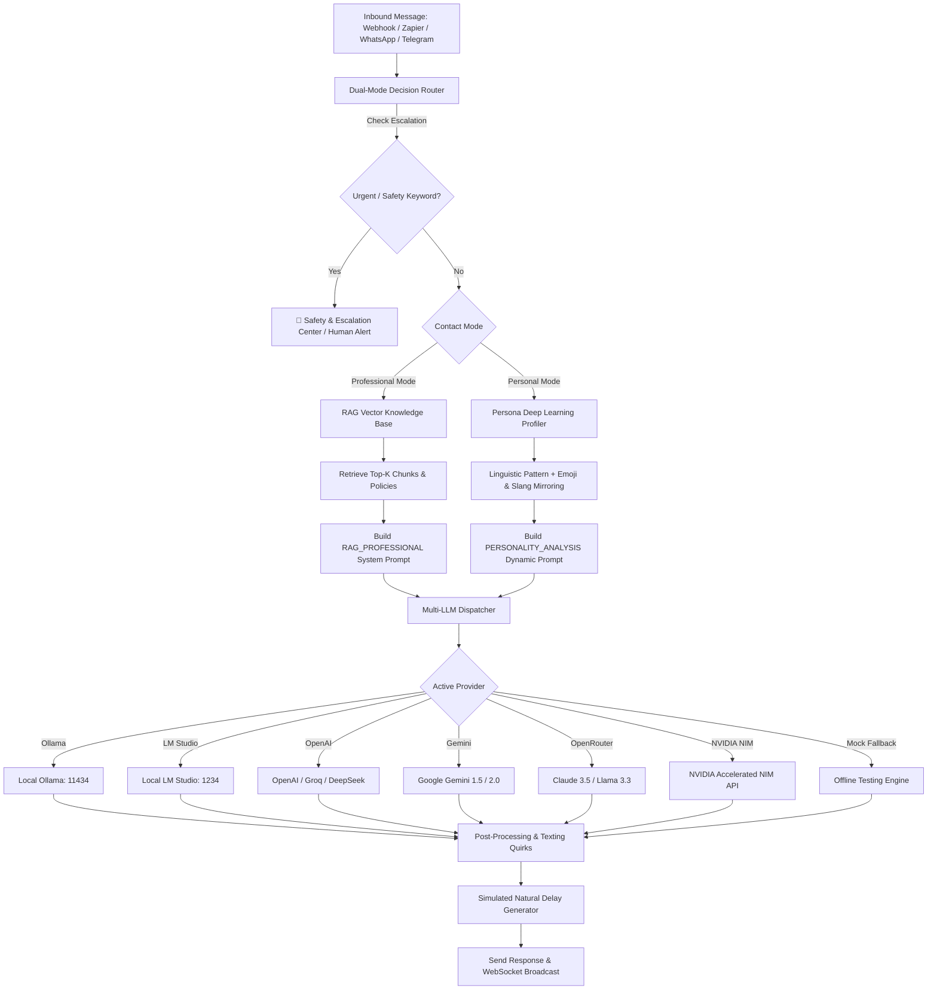

# 👻 GhostReply — Context-Aware Dual-Mode AI Auto-Response System

<p align="center">
  
  
  
  
  
</p>

**GhostReply** is an intelligent, context-aware auto-response platform that operates in a **Dual-Mode Architecture**:

1. **💼 Mode 1: Professional Mode (Business & Customer Support)**
   - Knowledge-grounded **RAG (Retrieval-Augmented Generation)** from uploaded documentation (policies, FAQs, SLAs).
   - Strict factual citations with zero hallucination.
   - Automatic escalation detection for legal threats, pricing disputes, and complaints.
   - Professional sign-offs and human handoff routing.

2. **❤️ Mode 2: Personal Mode (Friends, Family & Social)**
   - **Persona Mirroring**: Analyzes chat history (`_chat.txt` WhatsApp exports or Telegram JSON).
   - Extracts 4-Phase linguistic profiles: Formality score ($0.0 - 1.0$), abbreviation dictionaries (`u`, `rn`, `fr`, `lmao`), emoji style & frequency, code-switching, and inside jokes.
   - Simulates natural human typing delays and emotional mirroring.

---

## 🏛️ System Architecture



---

## ⚡ Supported AI Providers

GhostReply features a unified multi-provider engine. Switch seamlessly in the dashboard or via API:

| Provider | Endpoint Default | Supported Models |
| :--- | :--- | :--- |
| **🦙 Ollama (Local)** | `http://127.0.0.1:11434` | `llama3.2`, `mistral`, `qwen2.5`, `phi3` |
| **🧪 LM Studio (Local)** | `http://127.0.0.1:1234/v1` | Any loaded GGUF model (`local-model`) |
| **🟢 OpenAI Compatible** | `https://api.openai.com/v1` | `gpt-4o-mini`, `gpt-4o`, DeepSeek-V3, Groq |
| **✨ Google Gemini** | Google GenAI REST API | `gemini-1.5-flash`, `gemini-1.5-pro`, `gemini-2.0-flash-exp` |
| **🌐 OpenRouter** | `https://openrouter.ai/api/v1` | `anthropic/claude-3.5-sonnet`, `meta-llama/llama-3.3-70b` |
| **⚡ NVIDIA NIM API** | `https://integrate.api.nvidia.com/v1` | `meta/llama-3.1-70b-instruct`, `mistralai/mixtral-8x22b` |
| **🤖 Smart Fallback** | Local In-Memory | Mode-aware zero-config instant offline testing engine |

---

## 🤖 AI Automation & API Trigger Schema

GhostReply can be triggered by external AI agents, webhooks, or automation workflows (**Zapier, n8n, Make.com, LangChain, Flowise, AutoGen**).

### 1. Schema Endpoints
- **OpenAPI 3.0.3 Specification**: `GET http://localhost:3000/api/openapi.json`
- **Automation JSON Schema**: `GET http://localhost:3000/api/schema/automation`
- **Schema Files in Repo**:
  - [`schema/openapi.json`](schema/openapi.json)
  - [`schema/openapi.yaml`](schema/openapi.yaml)
  - [`schema/automation-schema.json`](schema/automation-schema.json)
  - [`schema/database-schema.sql`](schema/database-schema.sql)

### 2. Webhook Automation Trigger (`POST /api/webhook/trigger`)

#### cURL Example:
```bash
curl -X POST http://localhost:3000/api/webhook/trigger \
  -H "Content-Type: application/json" \
  -d '{
    "contactId": "contact_wife",
    "senderName": "Maya",
    "text": "When u coming home? 😤",
    "platform": "whatsapp"
  }'
```

#### Response:
```json
{
  "success": true,
  "reply": "soon soon 😂 stuck in traffikk u know how it issss. love u ❤️",
  "mode": "personal",
  "escalated": false,
  "escalationReason": null,
  "provider": "Ollama",
  "model": "llama3.2:latest",
  "delaySimulatedMs": 2100,
  "processingTimeMs": 340,
  "timestamp": "2026-08-28T08:55:00.000Z"
}
```

#### Professional Mode cURL (e.g. from Zendesk / Helpdesk / Twilio):
```bash
curl -X POST http://localhost:3000/api/webhook/trigger \
  -H "Content-Type: application/json" \
  -d '{
    "contactId": "client_ticket_402",
    "senderName": "David Vance",
    "text": "Do you offer refunds for unused software packages?",
    "forceMode": "professional"
  }'
```

#### Python Automation Script:
```python
import requests

url = "http://localhost:3000/api/webhook/trigger"
payload = {
    "contactId": "+15552345678",
    "senderName": "Jake",
    "text": "bro that party was wild last night 💀",
    "platform": "telegram"
}

response = requests.post(url, json=payload)
data = response.json()
print("GhostReply Response:", data["reply"])
```

#### Node.js / TypeScript Example:
```typescript
import axios from 'axios';

async function sendAutoReply(incomingText: string, contactId: string) {
  const res = await axios.post('http://localhost:3000/api/webhook/trigger', {
    contactId,
    text: incomingText,
    platform: 'whatsapp'
  });
  return res.data;
}
```

---

## 🚀 Quick Start & Installation

### Prerequisites
- [Node.js](https://nodejs.org/) (v18 or higher)
- Optional: Local [Ollama](https://ollama.com/) or [LM Studio](https://lmstudio.ai/)

### Installation Steps

```bash
# 1. Clone the repository
git clone https://github.com/ilavarasanAppu/GhostReply-DualMode-AI-AutoResponder.git
cd GhostReply-DualMode-AI-AutoResponder

# 2. Install dependencies
npm install

# 3. Run automated tests
npm test

# 4. Start the GhostReply Server
npm start
```

Open your browser at **`http://localhost:3000`** to access the GhostReply dashboard.

---

## 📂 Project Structure

```
├── package.json                   # Dependencies and scripts
├── ghostreply.db                  # Local SQLite database
├── src/
│   ├── server.js                  # Express & WebSocket server
│   ├── db/
│   │   └── database.js            # SQLite schema manager & initial seeds
│   ├── routes/
│   │   └── api.js                 # REST API & Webhook automation routes
│   └── services/
│       ├── llmService.js          # Multi-LLM provider connector (Ollama, LM Studio, OpenAI, Gemini, OpenRouter, NVIDIA)
│       ├── ragService.js          # RAG Knowledge Base chunking, vector scoring & escalation triggers
│       ├── personalityService.js  # 4-Phase Persona profiler & WhatsApp/Telegram parser
│       ├── decisionEngine.js      # Dual-mode pipeline coordinator & real-time dispatcher
│       ├── whatsappService.js     # WhatsApp Web session & QR code manager
│       └── telegramService.js     # Telegram Bot polling & token verification
├── schema/
│   ├── openapi.json               # OpenAPI 3.0.3 Specification (JSON)
│   ├── openapi.yaml               # OpenAPI 3.0.3 Specification (YAML)
│   ├── automation-schema.json     # JSON Schema for Zapier, n8n, Make, Flowise
│   └── database-schema.sql        # SQL DDL database schema
├── public/
│   ├── index.html                 # Glassmorphic cyber dashboard UI
│   ├── styles.css                 # Custom CSS design system
│   └── app.js                     # Real-time frontend application logic
└── test/
    └── run-tests.js               # Complete unit & integration test suite
```

---

## 🛡️ Safety & Escalation Rules

GhostReply includes built-in safeguards:
- **Emergency Keywords**: Messages containing `urgent`, `emergency`, `hospital`, `call me`, `police`, `suicide`, or `lawsuit` are automatically flagged.
- **Human Handoff Queue**: Flagged interactions pause auto-reply and display in the **Safety & Escalation Center** for human review and manual reply.
- **Strict Anti-Hallucination**: Professional mode strictly limits responses to documented context and uses the escalation phrase when answers are unavailable.

---

## 📄 License

MIT License — Feel free to use, modify, and distribute for personal and commercial projects.
